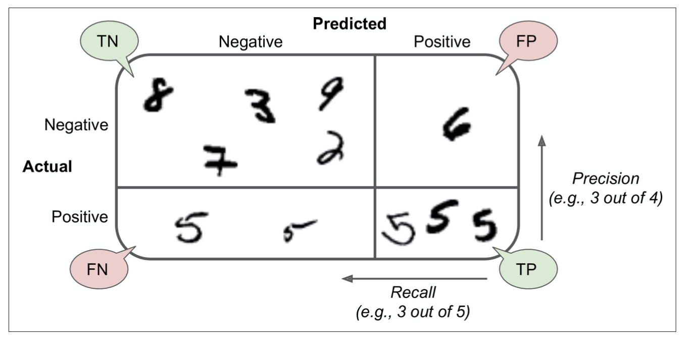

# Classification

**Binary classification**

```python
y_train_5 = (y_train_5 == 5) # turning multi-class into binary for specific digit
y_test_5 = (y_test_5 == 5)

sgd_clf = SGDClassifier(random_state = 42) 
# SGD classifier in sklearn has the advantage of being capable of handling very large dataset efficient. And since it deals with training instances independently, one at a time, it is also well suituied for online learning. 
```

**Performance measures**

* Measure accuracy using cross-validation

  Accuracy is generally not the preferred performance measure for classifiers, especially when you are dealing with *skewed datasets*.

  ```python
  # manual cross_val_score
  from sklearn.base import clone

  skfolds = StratifiedKFold(n_splits = 3, random_state = 42)
  for train_index, text_index in skfolds.split(X_train, y_train_5):
    clone_clf = clone(sgd_clf)
    X_train_folds = X_train[train_index]
    y_train_folds = y_train_5[train_index]
    X_test_fold = X_train[test_index]
    y_test_fold = y_train_5[test_index]

    clone_clf.fit(X_train_folds, y_train_folds)
    y_pred = clone_clf.predict(X_test_fold)
    n_correct = sum(y_pred == y_test_fold)
    print(n_correct/len(y_pred))

  # sklearn implementation
  cross_val_score(sgd_clf, X_train, y_train_5, cv=3, scoring='accuracy')
  ```

* Confusion matrix

  ```python
  y_train_pred = cross_val_predict(sgd_clf, X_train, y_train_5, cv=3)
  # It returns the predictions made on each test fold, This means you get a clean prediction for each instance in the training set. 
  
  # Generally, test set is only used at the very end of the project, so instead of using test set to preduce confusion matrix, cross_val_predict can be used. 

  confusion_matrix(y_train_5, y_train_pred)
  # Each row represents an actual class, and each column represent a predicted class
  ```

  * Precision, recall and F1

    * Formula
    $$
    \text{Precision} = \frac{TP}{TP+FP}
    $$

    $$
    \text{Recall} = \frac{TP}{TP+FN}
    $$

    


    $$
    F_1 = 2 \times \frac{\text{precision} \times \text{recall}}{\text{precision} + \text{recall}}
    $$

    * recipe

    ```python
    precision_score(y_train_5, y_train_pred)
    recall_score(y_train_5, y_train_pred)
    f1_score(y_train_5, y_train_pred)
    ```

    * Precision recall tradeoff

      Sklearn does not let you set the threshold directly, but it des give you access to the decision socre that it uses to make predictions. 

      ```python
      y_scores = sgd_clf.decision_function([some_digit])
      ```

    * How to select the threshold 

      ```python
      y_scores = cross_val_predict(sgd_clf, X_train, y_train_5, cv =3, method = "decision_function") # return the decision scores for each instance

      precisions, recalls, thresholds = precision_recall_curve(y_train_5, y_scores)

      plt.plot(thresholds, predicions[:-1], "b--", lable="precision")
      plt.plot(thresholds, recalls[:-1], "g--", lable="recall")

      # By plotting the curve, you would be able to identify the suitable threshold
      ```
    
    Another way would be to plot precision against recall. 

    ```python
    # say you want to aim for 90% percision. 
    threshold_90_precision = thresholds[np.argmax(precisions>=0.90)] # return the lowerst threshold that gives you at least 90% precision
    y_train_pred_90 = (y_scores >= threshold_90_precision) # make predictions
    ```

    If someone said "Let's have 99% precision", you should ask "at what recall ? "

* ROC curve
  
  ROC curve is True positive rate vs false positive rate. 

  $$
  TPR = \frac{TP}{TP+FN}
  $$
  
  $$
  FPR = \frac{FP}{FP+TN}  
  $$

  ```python
  fpr, tpr, thredsholds = roc_curve(y_train_5, y_scores)

  ```
  
  One way to compare classifiers is to measure the *area under the curve (AUC)*. 

* ROC or PR ? 

  Prefer the PR curve whenever the positive class is rare or when you care more about the false positives than the false negatives. ROC curve otherwise. 


* For classifiers that does not have "decision function"

  ```python
  forest_clf = RandomForestClassifier(random_state=42)
  y_probas_forest = cross_val_predict(forest_clf, X_train, y_train_5, cv=3, method="predict_proba")

  # to plot ROC, scores, not probabilities are needed. 
  y_scores_forest = y_probas_forest[:, 1] # score = proba of positive class
  fpr_forest, tpr_forest, thresholds_forest = roc_curve(y_train_5, y_scores_forest)

  ```

**Multiclass classification**

Some algos (Random forest or naive bayes)  are capable of handling multiple classes directly. Others (SVM or Linear classifier) are strictly binary classifiers. 

* Strategies

  * One vs all (OvA)
    
    One way to create a system that can classify the digit into 10 classes (MNIST) is to train 10 binary classifier, one for each digit. And when inference, get the decision score from each classifier for that image and select the class whose classifier outputs the highest score. 

  * One vs one (OvO)
    
    Train a binary classifier for every pair of digits. So in MNIST, there would be $N \times (N-1)/2$ classifier. 

  Some algos (SVM) scale poorly with size of training set, so for these algos, OvO would be preferred as it is faster to train many classifiers on smaller trainign sets than training fewer classifier on large training sets. However, for most binary classifier, OvA is preferred.

* Recipe

  Sklaern detects when you try to use binray algo for a multiple class task, and it automatically runs OvA (except for SVM, it uses OvO). 
  ```python
  sgd_clf.fit(X_train, y_train)
  some_digit_score = sgd_clf.decision_function([some_digit]) # instead of returning just one score per instance,it returns 1- scores, one per class.

  # When a classifier is trained, it stores the list of target classes in its classes_ attribute, ordered by value. 
  ```

  If you want to force Sklearn to use OvO or OvA, you can use OneVsOneClassifier or OneVsRestClassifier classes. 
   

  ```python
  ovo_clf = OneVsOneClassifier(SGDClassifier(random_state=42))
  ```

**Error analysis**

* Look at confusion matrix

  ```python
  y_train_pred = cross_val_predict(sgd_clf, X_train_scaled, y_train, cv=3)

  conf_mx = confusion_matrix(y_train, y_train_pred)

  plt.matshow(conf_mx, cmap=plt.cm.gray)
  ```

* Look at errors
  
  ```python
  row_sums = conf_mx.sum(axis=1, keepdims=True)
  norm_conf_mx = conf_mx/row_sums

  np.fill_diagonal(norm_conf_mx, 0) # fill the diagonal with zeros to keep only the errors
  plt.matshow(norm_conf_mx, cmap=plt.cm.gray) 
  ```

**Multilabel classification**

```python
y_train_large = (y_train >= 7)
y_train_odd = (y_train % 2 == 1)
y_multilabel = np.c_[y_train_large, y_train_odd] # y_multilabel array containing two target labels for each digit image.

knn_clf = KNeighborsClassifier() # KNN supports multilabel classification, but not all classifiers do
knn_clf.fit(X_train, y_multilabel)

y_train_knn_pred = cross_val_predict(knn_clf, X_train, y_multilabel, cv=3)
fl1_score(y_multilabel, y_train_knn_pred, average="macro") # measure the F1 score for each individual label and then compute the average.

# The aobve assumes that all lables are equally important, which maybe not be the case. 
# To give each label a weight equal to its support, can simply set average="weighted"
```

**Multioutput classification**

A generalization of multilabel classification where each lable can be multiclass.

```python
noise = np.random.randint(0, 100, len(X_train), 784)
X_train_mod = X_train + noise

noise = np.random.randint(0, 100, len(X_test), 784)
X_train_mod = X_test + noise

y_train_mod = X_train
y_test_mod = X_test

knn_clf.fit(X_train_mod, y_train_mod)
clean_digit = knn_clf.predict([X_test_mod[some_index]])
plot_digit(clean_digit)
```

