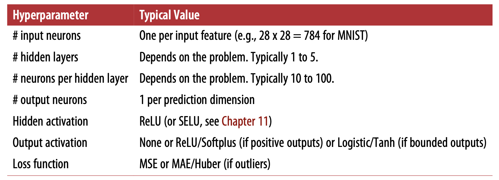
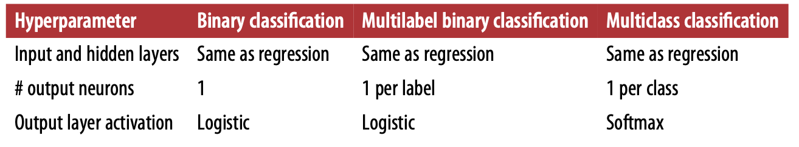
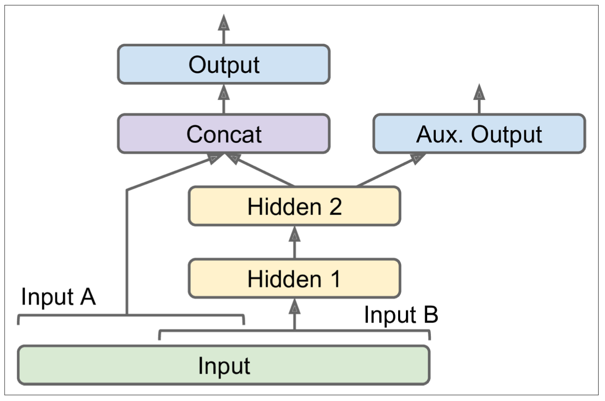

# Introduction to ANN with Keras

**MLP**

* Sklearn

  ```python
  iris = load_iris()
  X = iris.data[:, (2,3)] # petal length, petal width
  y = (iris.target == 0).astype(np.int) # Iris Setosa ?

  per_clf = Perceptron()
  per_clf.fit(X, y)

  # it is the same as using a SGDClassifier with loss = "perceptron" and learning_rate = "constant", eta0=1, and penalty=None (no regularization)
  ```

* It is important to initialize all the hidden layer's connection weights randomly. 

* Activation functions
  
  * Sigmoid 
    $$
    \sigma(z) = \frac{1}{1+exp(-z)}
    $$

  * Tanh
    
    Just like the logisic function, it is S-shaped, continuous, and differentiable, but its output value ranges from -1 to 1 (instead of 0 to 1), which tends to make each laeyer's output more or less cnetered around 0 at the beginning. This ofen helps speed up convergence.
    $$
    tanh(z) = 2\sigma(2z)-1
    $$

  * Relu

    $$
    ReLU(z) = max(0, zß)
    $$

* Regression MLPs

  * WHen building an MLP for regression, you don not want to use any activation function for the output neurons. If you want to guarantee that the output will always be positive, then you can use ReLU or softplus on output layers. If you want to guarantee the predictions willf all within a given range of values, then you can use logistic function, or the tanh function. 

  * THe loss function is typically mean squired error. If you have quite a lot outliers, you may perfer to use mean absolute error instead. Alternatively you can use Huber loss. Huber loss is quadratic when teh error is smaller than a threshold $\delta$ (typically 1), but linear when the error si larger than $delta$, It makes it less sensitive to outlier than MSE and often more precise and converges faster than AME

  

* Classification MLPs

  * Binary classification

    You just need a single output neuron using logistic activation function. 

  * Multilabel binary classification
    
    One output neuron per label.

  * Multi class classification

    One output neuron per class, and use softmax activation function for the whole output layer

    
    


**MLP with Keras**

At present, you can choose from three open source deep learning libraries for the computation backend: Tensorflow, CNTK, and Theano. 

(This book use tf.keras as backend for ease of explaiantion)

* Installing Tensorflow 2

```bash
# activate virtualenv
cd $ML_PATH
source env/bin/activate # non Windows 
.\env\Scripts\activate # Windows

# installation
python3 -m pip install --upgrade tensorflow # or tensorflow-gpu for GPU support
```

* Building image classicifier using Sequential API

  ```python
  fashion_mnist = keras.datasets.fashion_mnist
  (X_train_full, y_train_full), (X_test, y_test) = fashion_mnist_load_data() # Unlike sklearn, Keras load the image as a 28 x 28 array instead of a 1d array of size 784. Also, the pixel intensities are represented as integers rather than floats. 

  # Since we are going to traing the neural network using Gradient Descent, we must scale the input features. 
  X_vaid, X_train = X_train_full[:5000]/255.0, X_train_full[5000:]/255.0
  y_valid, y_train = y_train_full[:5000], y_train_full[5000:]

  class_names = ["T-shirt/top", "Trouser", "Pullover", "Dress", "Coat", "Sandal", "Shirt", "Sneaker", "Bag", "Ankle boot"]

  class_names[y_train[0]] # find the label for the first training sample

  model = keras.models.Sequential([
      keras.layers.Flattern(input_shape=[28,28]),
      keras.layers.Dense(300, activation="relu"),
      keras.layers.Dense(100, activation="relu"),
      keras.layers.Dense(10, activation="softmax")
  ])

  model.summary()
  
  model.layers
  model.layers[1].name
  model.get_layer("dense_3").name
  weights, biases = hidden1.get_weights()
  # If you want to use a different intialization method, you can set kernel_initializer and biase_initializer when creating the layer. 

  # The shape of the weight matrix depends on the number of inputs, so it is recommended to specify the input_shape when creating the first layer. If left unspecified, then keras would wait for it knows the input shape, eighter when you call build(), or when you train the model. But if left unspecified, you will not be able to do certain things, like print the model summary or save the model. 

  model.compile(loss="sparse_categorical_crossentropy",
   optimizer="sgd",
   metrics=["accuracy"])
  # if you want to convert sparse labels (class indices) to one-hot vector labels, you can use keras.utils.to_categorical(). To go the other way round, you can use np.argmax() with axis = 1

  history = model.fit(X_train, y_train, epoch=30, validation_data=(X_valid, y_valid)) # instead of passing a validation set using validation_data, you can instead of set validation_split to the ratio you want. 

  # If the training set is skewed, you can set the class_weight. If you prefer per-instance weights, you can set the sample_weight (it supersedes class_weight). You can also provide sample weights (but not class weights) for the validation set by adding them as a third term in the valudation_data tuple. 

  # fit() method returns a History object, which contains training parameters (history.params), the list of epochs it went thru (history.epoch), and a dictionary containing loss and extra metrics (history.history). 

  pd.DataFrame(history.history).plot(figsize=(8,5))
  plt.grid(True)
  plt.gca().set_ylim(0,1)
  plt.show()

  model.evaluate(X_test, y_test) # it supports several other arguments, such as batch_size and sample_weight

  y_proba = model.predict(X_new) # this would return one probability per class for each instance
  y_pred = model.predict_classes(X_new)
  np.array(class_names)[y_pred]
  ```

* BUilding a regression MLP using sequential API

  ```python
  from sklearn.model_selection import train_test_split

  housing = fetch_california_housing()
  X_train_full, X_test, y_train_full, y_test = train_test_split(
      housing.data, housing.target
  )
  X_train, X_valid, y_train, y_valid = train_test_split(
      X_train_full, y_train_full
  )

  scaler = StandardScaler()
  X_train_scaled = scaler.fit_transform(X_train)
  X_valid_scaled = scaler.transform(X_valid)
  X_test_scaled = scaler.transform(X_test)

  # Since the datset is quite noisy, we just use a single hidden layer with fewer neuros than before to avoid overfitting. 

  model = keras.models.Sequential([
      keras.layers.Dense(30, activation="relu", input_shape=X_train.shape[1:]),
      keras.layers.Dense(1)
  ])
  model.compile(loss="mean_squared_error", optimizer="sgd")
  
  ```
  
  Although sequential models are extremely common, it is someitmes useful to build neural networks with more complex topologies, or with multiple inputs or outputs. For this purpose, Keras offers the FUnctional API. 


  * BUilding complex models using functional API

    

    ```python
    # code snippet for the above architecture

    input_A = keras.layers.Input(shape=[5]) 
    input_B = keras.layers.Input(shape=[6])# 5 and 6 are just artificial examples

    hidden1 = keras.layers.Dense(30, activation="relu")(input_B)
    hidden2 = keras.layers.Dense(30, activation="relu")(hidden1)
    concat = keras.layers.concatenate([input_A, hidden2])
    output = keras.layers.Dense(1)(concat)
    aux_output = keras.layers.Dense(1)(hidden2)
    model = keras.models.Model(inputs=[input_A, input_B], outputs=[output, aux_output])

    model.compile(loss=["mse", "mse"], 
                  loss_weights=[0.9, 0.1],
                  optimizer="sgd")
    
    history = model.fit(
        [X_train_A, X_train_B], [y_train, y_train], epoch=20,
        validation_data=([X_valid_A, X_valid_B], [y_valid, y_valid])
    )

    total_loss, main_loss, aux_loss = model.evaluate([X_test_A, X_test_B], [y_test, y_test])

    y_pred_main, y_pred_aux = model.predict([X_new_A, X_new_B])
    # in this example, Aux. output is just used to perform regularization. So it should output the same thing as the output.
    ```

* Building dynamic models using subclassing API

  * Pros: 

    You can do anything in the call() methods, this makes it a great API for researchers experimenting with new ideas.
  
  * Cons:
    
    The model's architecture is hidden within the call() method, so Keras can not easily inspect it, it cannot save or clone it, and when you call summary(), you can only get a list of layers, without any info on how they are conne ted to each other. And Keras can't check types and sahpes ahead of time, and it is easier to make mistakes. 

  ```python
  
  class WideAndDeepModel(keras.models.Model):
    def __init__(self, units=30, activation="relu", **kwargs):
      super().__init__(**kwargs)
      self.hidden1= keras.layers.Dense(units, activation=activation)
      self.hidden2= keras.layers.Dense(units, activation=activation)
      self.main_output = keras.layers.Dense(1)
      self.aux_output = keras.layers.Dense(1)

    def call(self, input):
      input_A, input_B = inputs
      hidden1 = self.hidden1(input_B)
      hidden2 = self.hidden2(hidden1)
      concat = keras.layers.concatenate([input_A, hidden2])
      main_ouptut = self.main_output(concat)
      aux_output = self.aux_output(hidden2)
      return main_output, aux_output

  model = WideAndDeepModel()
  ```

**Saving and restoring a model**

```python
model.save("my_keras_model.h5") # save both model's architecture (including every layer's hypaerparemeters) and the vlaue of all the model parameters for every layer (connection weights and biases), suing HDF5 format, it also saves the optimizer. 
model = keras.models.load_model("my_keras_model.h5") # this will work using sequetial APi or funcitonal API, but not with model subclassing. You can use save_weights() and load_weights() to at least asave and restore the model parameters.
```

**Using callbacks**

The fit() method accepts a callbacks arugment that lets you specify a list of objects that Keras willcall during training at the start and end of training, at the start and end of each epoch and even before and after processing each batch. 

```python
checkpoint_cb = keras.callbacks.ModelCheckpoint("my_keras_model.h5", save_best_only=True) # save checkpoints of your model (incase your moputer crashes)
early_stopping_cb = keras.callbacks.EarlyStopping(patience=10, restore_best_weights=True) # actually interrupt training early when there is no more process and roll back to the best model
# Both the above cb can be combined tgt as below. 
history = model.fit(X_train, y_train, epoch=1000,
validation_data=(X_valid, y_valid), callbacks=[checkpoint_cb, early_stopping_cb])
```

You can write your own custom callbacks

```python
class PrintValTrainRatioCallback(keras.callbacks.Callback):
  def on_epoch_end(self, epoch, logs):
    print("\nval/train: {:.2f}".format(logs["val_loss"] / logs["loss"]))

# you can implement on_train_begin(), on_train_end(), on_epoch_begin(), on_batch_begin(), and on_batch_end(). Callbacks can also be used during evaluation and prediction, if you need them for debugging or other purposes. on_test_begin(), on_test_end(), on_test_batch_begin(), on_test_batch_end(), all of which called by evaluate().
# you can also implement on_predict_begin(), on_predict_end(), on_predict_batch_begin(), on_predict_batch_end() (all get called by predict())
```

**Tensorboard**

```python
root_logdir = os.path.join(os.curdir, "my_logs")

def get_run_logdir():
  import time
  run_id = time.strftime("run_%Y_%m_%d-%H_%M_%S")
  return os.path.join(root_logdir, run_id)

run_logdir = get_run_logdir()

#build and compile the model#
tensorboard_cb = keras.callbacks.TensorBoard(run_logdir)
history = model.fit(X_train, y_train, epochs=30,
validation_data=(X_valid, y_valid), callbacks=[tensorboard_cb])
```

```bash
tensorboard --logdir=./my_logs --port=6006
# If your shell cannot find the tensorboard script, you must update your APTH env variable. Or you can replace tensorboard with python3 -m tensorboard.main()
```

**Fine-tuning hyperparameters**

* Use sklearn wrapper to turn keras model into sk predictor and use gridsearch or randomizedsearch by sklearn

  ```python
  from scipy.stats import reciprocal
  # first step is to create a build_model function that build an compile a keras model, given a set of hyperparameters. 
  def build_model():
     ######
    return model
  keras_reg = keras.wrappers.scikit_learn.KerasRegressor(build_model)
  param_distribs = {
      "n_hidden":[0,1,2,3],
      "n_neurons": np.arrange(1, 100),
      "learning_rate": reciprocal(3e-4, 3e-2),
  }
  rnd_search_cv = RandomizedSearchCV(keras_reg, param_distribs, n_iter=10, cv=3)
  rnd_search_cv.fit(X_train, y_train, epochs=100, 
                    validation_data=(X_valid, y_valid),
                    callbacks=[keras.callbacks.EarlyStopping(patience=10)]) # randomized search cv using K-fold cross-validation, so it does not use X_valid and y_valid. Thre are for early stopping.

  rnd_search_cv.best_params_
  rnd_search_cv.best_score_
  model = rnd_search_cv.best_estimator_.model
  ```

  Libraries that can be used to optimize hyperparameters:
  * Hyperopt
  * Hyperas, kopt, Talos
  * Scikit-Optimize
  * Spearmint
  * Sklearn-Deap

* Number of hidden layers


  * Deep networks have a much higher parameter efficiency than shallow ones. 

  * For many problems, you can start with one or two hidden layers and it will work just fine. FOr more complex problems, you can gradually ramp up the number of hidden layers, until you start overfitting the training set. 

* Number of nuerons per hidden layer

  * It used to be a common practice to size the layers to form a pyramid, with fewer and fewer neurons at each layers. 
  * This practice has been largely abandon now, becuase it is proved that using the same number of neurons in a all hidden layers can perform jsut as well or even better, and it has just one hyperparemeter to turn. 

  * You can pick a model with more layers and neurons than you actually needn and use early stopping to prevent it from overfitting. Or you can try increase the number of neurons gradually until the network start overfitting. 

* Learning rate, batch size and other hyperparmeters

  * In general, the optimal learning rate is about half of the maximum learning rate (the learning rate above which the training algo diverges). So a simple appraoch for tuning the learning rate is to start with a large vlue that makes the training algo diverge, then divide this value by 3 and try again, and repeat until the training algo stops diverge. At that point, you generally won't be too far from the optimal learning rate. 

  * CHoosing a better optimizer than plain old mini-batch gradient descent is quite importnat. 

  * In general, the optimal batch size will be lower than 32. having a batch size greater than 10 helps take advantage of hardware and software optimization. If you are using Batch Normalization, the batch size should not be too small, in general no less than 20. 

  * 