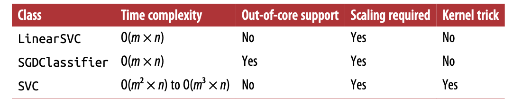
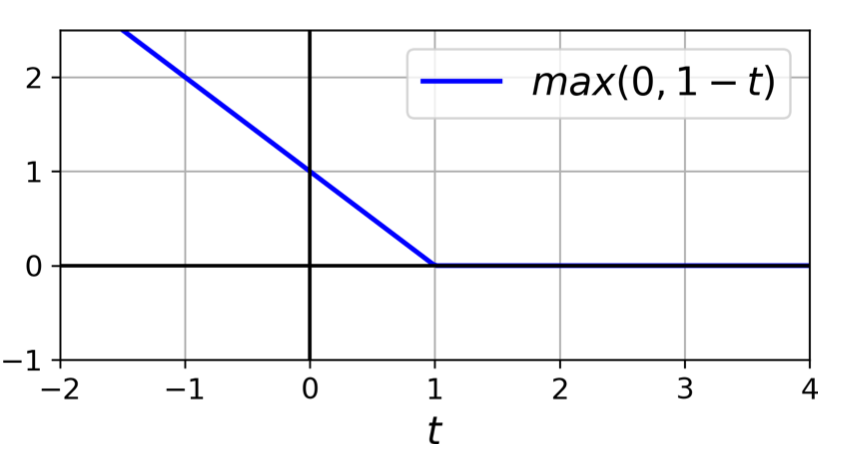

# Support Vector Machines

SVMs are particularly well suited for classification of complex but small- or medium-sized datasets.

SVMs are sensitive to the feature scales. SO better perform feature scaling before training SVM. 

**Linear SVM**

The issue with hard margin classification is that it is quite sensitive to outliers. Soft margin find a good balance between keeping the street (margin) as large as possible and limiting the margin violations. 

* hyper parameters

  * **C** A smaller C -> wider street but more margin violation -> generalize wll
  
  So if the SVM model is overfitting, regularization can be done by reducing C. 

* Note

  SVM classifiers do not output probabilities for each class.

  The LinearSVC class regularizes the bias term, so should center the data by subtracting its mean first. 

  Makes sure set loss to "hinge", as it is not the default value. 

  For better performance, dual should be set to False, unless there are more features than training instances. 

* receipe

  ```python
  svm_clf = Pipeline(
      [
          ("scaler", StandardScaler()),
          ("linear_svc", LinearSVC(C = 1, loss = "hinge"))
      ]
  )

  # Alternatively, SVC clas can be used with SVC(kernel = "linear", C = 1) -> much slower, especially with large training sets, not recommended

  # Another option, SGDClassifier(loss = "hinge", alpha = 1/(m*C)) -> this applies regular Stochastic Gradient Descent to train a linear SVM classifier. Does not converge as fast as LinearSVC, but can handle huge dataset that does not fit in memory or handle online classification tasks.
  ```

**Nonlinear SVM**

* PolynomialFeatures + LinearSVC 

  ```python 
  
  polynomial_svm_clf = Pipeline([
      ("poly_features", PolynomialFeatures(degree = 3)),
      ("scaler", StandardScaler()),
      ("svm_clf", LinearSVC(C=10, loss = "hinge"))
  ])
  ```

* Polynomial kernel
    
    Adding polynomial features is simple to implement and can work great, but a low polynomial degree can
    t deal with very complex dataset, and with high polynomial degree it creates a huge number of features, making the model too slow. 

    ```python
    poly_kernel_svm_clf = Pipeline(
        [
            ("scaler", StandardScaler()),
            ("svm_clf", SVC(kernel="poly", degree = 3, coef0=1, C =5))
        ]
    )
    # If the model is overfitting, you might want to reduce the polynomial degree, and if the model is underfitting, you can try increase it. 
    # coef0 controls how much the model is influenced by high-degree polynomials versus low-degree polynomials.
    ```
  * Note
    
    A common approach to find the right hyper-param is to use grid search. Often it is faster to do grid search (coarse) + grid search (finer).

* Adding similarity features

  Adding similarity features can be done the following steps:

  1. create landmark at the location of each and every instance (one possible way of finding landmark)
  2. Compute the new feature
      $$
      x_{trans} = exp(-\gamma (\vert \vert x-l \vert \vert)^2 )
      $$ 

  The downside is that a trainingset with m instances and n features gets transformed into a trainingset with m instnaces and m features (assuming the orignial features are dropped). And if the dataset is very large, then might end up with an equally large number of features. 

* Gaussian RBF kernel

  ```python
  rbf_kernel_svm_clf = Pipeline(
      [
          ("scaler", StandardScaler()),
          ("svm_clf", SVC(kernel = "rbf",
          gamma = 5, C = 0.001))
      ]
  )
  ```
  * $\gamma$ and C
    
    Big $\gamma$ -> bell-shape narrower -> each isntance's range of influence smaller -> decision boundary more irregular

    If overfit -> reduce $\gamma$ and C. 

* Other kernels 

  * string kernels are usually used for text document or DNA sequences classification (using the string subsequence kernel or kernels based on the Levenshtein distance)

* Which kernel to choose ? 

  Always try the linear kernel first (LinearSVC is much faster than SVC with linear kernel, espeically if the dataset is very large or if it has plenty of features.) If the dataset is not too large, should try Baussian RBF kernel as well. If you have spare time adn computing power, might experiment with a few other kernels using cross-validation and grid search, especially if there are kernels specialized for training set's data structure. 


* Computational Complexity

  * **Linear SVM**

    LinearSVC based on liblinear library, and it does not support the kernel trick, but it scales almost linearly with the number of training instances and the number of features $O(m \times n)$

    This algorithm takes longer if a very high precision is required, and it is controled by the tolerance hyperparemeter $\epsilon$ (tol in sklearn). In most classification tasks, the default tolerance is fine. 

  * **SVC** 

    It is based on libsvm library that supports kernel trick. It is usually $O(m^2 \times n)$ or $O(m^3 \times n)$. It does not scale well with dataset size. However, it scales well with number of features, especially with sparse features. 

    
    comparison


**SVM Regression**

Instead of trying to fit the largest possible street between two classes while limiting margin violations, SVM regression tries to fit as many instances as possible on the street while limiting margin violations. The width of the street is controlled by $\epsilon$. So the bibger the $\epsilon$, the more samples would end up on the street. Adding more training instances within the margin does not affect the model's prediction, thus the model is said to be $\epsilon-insensitive$. 

```python
# linear svm regression
svm_reg = LinearSVR(epsilon=0.5)

# nonlinear svm regression
svm_poly_reg = SVR(kernel= "poly", degree = 2,      C=100, epsilon = 0.1)
```

**Under the hood**

* Quadratic programming (QP) problems

  * Hard margin linear SVM classifier objective

    $$
    minimize_{w, b} \frac{1}{2} w^T w
    $$
    $$
    subject to t^i(w^Tx^i+b) \geq 1  
    $$

  * Soft margin linear SVM classifier objective

    $$
    minimize_{w, b} \frac{1}{2} w^T w + C \sum_{i=1}^m \zeta^i
    $$
    $$
    subject to t^i(w^Tx^i+b) \geq 1 - \zeta^i \text{ and } \zeta^i \geq 0
    $$

    where $\zeta^i$ is the slack variable for each instance, it mearues how much the $i^{th}$ instance is allowed to violate the margin.

* Dual problems
  
  Dual problem is faster to solve than the primal when the number of tarining instances is smaller than the number of features. 
  
* Common kernels 

  Linear
  $$
  K(a,b)=a^Tb
  $$
  Polynomial
  $$
  K(a,b) = (\gamma a^Tb+r)^d
  $$
  Gaussian RBF
  $$
  K(a,b) = exp(\gamma \vert \vert a-b \vert \vert^2)
  $$
  Sigmoid
  $$
  K(a,b) = tanh(\gamma a^T b+r)
  $$

**Online SVM**

* For linear problems, SGDClassifier might be used. 

* For non-linear problems, matlab and c++ implementation are aviabale. For large scale nonlinear problems, you may want to consider using neural networks instead.

**Hinge loss**

$$
max(0, 1-t)
$$


    hinge loss
