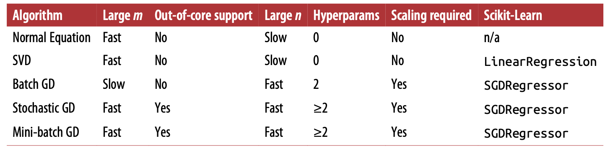
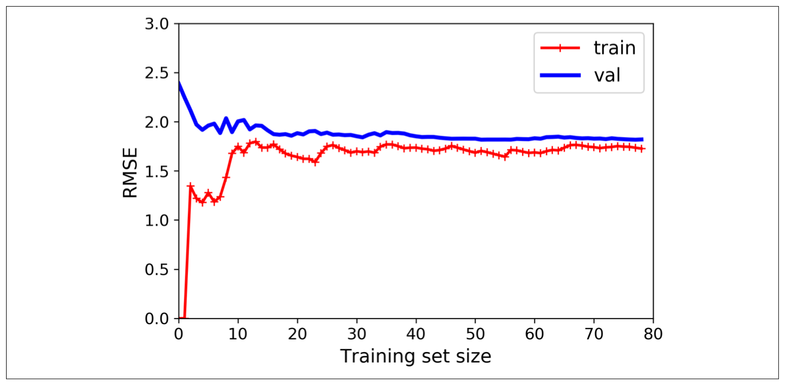

# Training models

In ML, vectors are often represented as *column vectors*, which are 2D arrays with a single column. If $\theta$ and $X$ are column vectors, then the prediction is $\hat{y} = \theta^TX$

**Normal equation**

To find the value of $\theta$ that minimizes the cost function, there is a *closed-form solution*, which is defined as below:
$$
\hat{\theta} = (X^TX)^{-1}X^Ty
$$

```python
theta_best = np.linalg.inv(X_b.T.dot(X+b)).dot(X_b.T).dot(y)

X_new = np.array([[0],[2]])
X_new_b = np.c_[np.ones((2,1)), X_new] # add x0=1 to each instance
y_predict = X_new_b.dot(theta_best)


#Below use sklearn linear regression
lin_reg.fit(X, y)
lin_reg.intercept_, lin_reg.coef_

# LinearRegression class in sklearn is based on the scipy.linalg.lstsq() which you can call directly as below:
theta_best_svd, residuals, rank, s = np.linalg.lstsq(X_b, y, rcond=1e-6)
# The above function computes theta_hat = X^{+} where X^{+} is the pseudoinverse of X. You can use np.linalg.pinv() to compute the pseudoinverse directly

np.linalg.pinv(X_b).dot(y)
```

* Note

  pseudoinverse is computed using SVD. And it sets zero to all values smaller than a tinay threshold value and then replaces all the non-zero values with their inverse, and then finally transposes the resulting matrix. It is more efficient than computing the Normal Equation, and it is always defined even if the matrix X^{T}X is not invertible. 

  The computational complexity of inverting a matrix is typically about $O(n^{2.4})$ to $O(n^3)$. And the SVD appraoch using sklearn is usually $O(n^2)$. Both normal euqation and the sVD get very slow when the number of features grow large (100,000). On positive side, both are linear with regards to the nubmer of instances in training set, so they handle large set efficiently, provided they can fit in memory. 


**Gradient descent**

* Note

  The MSE cost function for a Linear REgression model happens to be *convex funciton*, which means there are no local minima, just one global minimum. It is also a continuous function with a slpe that never changes abruptly (Lipschitz continuous). 
 
  When using gradient descent, you should esure that all features have a similar scale, or else it would take much longer to converge.

* Batch gradient descent

  It uses the whole batch of training data at every step. As a result, it is terribly slow on very large training sets. However, it scales well with the number of features, which means that training a linear regression model when there are hundreds of thousands of features is much faster using gradient descent than using normal equation or SVD decomposition. 

  ```python
  eta = 0.1
  n_iter = 1000
  m = 100

  theta = np.random.randn(2,1) # random initialization

  for itertaion in range(n_iter):
    gradient = 2/m*X_b.T.dot(X_b.dot(theta)-y)
    theta = theta - eta * gradient
  ```

  How to set the numer of iterations? A simple solution is to set a very large number of iterations but to interrupt the algo when the gradient vector becomes tiny - when its norm becomes smaller than a tiny number $\epsilon$. 
  
  It can take $O(1/\epsilon)$ iterations to reach the optimum within a range of $\epsilon$ depending on the shape of the cost function. If you divide the tolerance by 1- to have a more precise solution, then the algo may have to run about 10 times longer. 

* Stochastic gradient descent

  * Compared to batch gradient descent, it makes it possible to handle large dataset, since only one instance needed.

  * And also it is much faster. On the other hand, due to its stochastic nature, it is much less regular than Batch gradient descent. 

  * It has a better chance of finding the global minimum than batch gradeint descnet, since it can actualy help the algo jump out of the local mimima. 

  * TO overcome the issue of never settle at th minimum, one solution is to gradually reduce the leraning rate. This process is akin to *simulated annealing*, and the function that determines the learning rate at each iteration is called the *learning schedule*.

  * When using sgd, the training instances must be IID, to ensure that the paramter get pulled towards the global optimium, on average. A simple way to ensure this is to shuffle the instaces during training. 
  
  ```python
  sgd_reg = SGDRegressor(max_iter=1000, 
    tol=1e-3, penalty=None, eta0=0.1)
  ```

* Mini=batch gradient descent

  Inbetween batch gradescent and sgd. 

* Comparison

  

**Polynomial regression**

Use sklearn's PolynomialFeatures class to trainsform the trainingdata. 

```python
poly_features = PolynomialFeatures(degree=2,      include_bias=False)
X_poly = poly_features.fit_transform(X)
lin_reg.fit(X_poly, y)
```

PolynomialFeatures(degree=d) would transforms an array containing n features into an array containing $\frac{(n+d)!}{n!d!}$.

```python
polynomial_regression = Pipeline([
    ("poly_features", PolynomialFeatures(degree=10, include_bias=False)),
    ("lin_reg", LinearRegression())
])
```

**Learning curve**

There are two ways to tell whether the model is overfitting or underfitting the data. 

* Use cross-validation. If the model performs well on training set but generalizes poorly according to the cross-validation metrics, then the model is overfitting. If it performs pooly on both, then it is underfitting.

* Look at the *learning curves*. Plot the model's performance on the training set and the validation set as a function of the training set size (or the training iteration), producing something as below:



**Regularized linear models**

* Ridge regression 