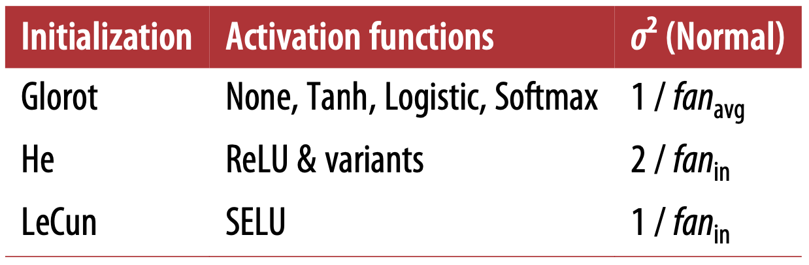

# Tranining deep neural networks

**Vanishing/Exploding gradients**

With sigmoid activation function and random initialization using a normal distribution with a mean of 0 and a standard deviation of 1, the variance of the outputs of each layers is much greater than the variance of its inputs. Going forward in the network, the variance keeps increasing after each layer until the activation function saturates at the top layers. This is made worse by the fact that the logistic function has a mean of 0.5. 

* Glorot and He initialization

  Normal distribution with mean 0 and variance

  $$
  \sigma^2 = \frac{1}{fan_{avg}}
  $$

  or a uniform distribution between $-r$ and $+r$ where

  $$
  r = \sqrt{\frac{3}{fan_{avg}}}
  $$

  where $fan_{avg} = (fan_{in}+fan_{out})/2$ and $fan_{in}$ represents the number of inputs, and $fan_{out}$ represnets the number of neurons.

  If you replace $fan_{avg}$ with $fan_{in}$, you get an initialization strategy that was proposed by Yann LeCun called *LeCun initialization*.


  
  These strategies differ only by the scale of the variance and whether they use $fan_{avg}$ or $fan_{in}$. For the uniform distribution, just compute $r=\sqrt{3\sigma^2}$. The initialization strategy for the ReLU and its variance including ELU is someitimes called He initialization. The SELU activation function should be used with LeCun initialization (preferably with a normal distribution).

  ```python
  # By default, keras use Glorot initialization with a uniform distribution, you can change this to he initialization by setting kernel_initializer="he_uniform" or kernel_initializer="he_normal" liike below
  keras.layers.Dense(10, activation="relu", kernel_initializer="he_normal")

  # If you want He initialization with a uniform distribution, but based on fan_vag rather than fan_in, then you can use the VarianceScaling initializer:
  he_avg_init = keras.initializers.VarianceScaling(scale=2, mode="fan_avg", distribution="uniform")
  keras.layers.Dense(10, activation="sigmoid", kernel_initializer=he_avg_init)
  ```

* Nonsaturating activation functions

  * ReLU 
    
    During training, some neurons effectively die. In some cases, you may find that half of your network's neurons are dead, especially if you used a large learning riate. 

  * Leaky ReLU:
    
    $$
    \text{LeakyReLU}_{\alpha}(z) = max(\alpha z, z)
    $$

    this small slope $\alpha$ make sure that they have a chance to eventually wake up. 
    * Papers show that setting $\alpha=0.2$ (huge leak) seemed to result in better performane than $\alpha=0.01$ (small leak). 
    * They also evaluated randomized leaky relu, where $\alpha$ is picked randomly in a given range during training, and it is fixed to an average value during test. It performed fairly well and seemed to act as a regularizer. 
    * Parametric leaky relu, where $\alpha$ is authorized to be learned during training. This report to strongly outperform ReLU on large image datasets, but on smaller datasets it runs the risk of overfitting. 
  
  * ELU
    
    $$
    \text{ELU}_{\alpha}(z) = \{\begin{array}{lr}
        \alpha (exp(z)-1), & \text{if } z<0\\
        z, & \text{if } z \geq 0 
        \end{array}

    $$

    * $z$ is usualy set to 1, but you can tweak it. 
    * It has a nonzero gradient for $z<0$, avoids the dead neurons problem
    * Main drawback is ti is slower to compute, but it is compensated by the faster convergence rate. 

  * SELU
    
    If you build a network composed exclusively of a stack of dense layers, and if all hidden layers sue the SELU activation (scaled version of ELU), the network will self-normalize. 

    * Input features must be standardized.
    * Every hidden layer's weights must be initalized using LeCun normal initialization. In keras, it means setting kernel_initializer="lecun_normal".
    * The network's architecture msut be sequential (no RNN, no skip connection).
    * Self-normalization are only guaranteed when all layers are dense. However, in practice, it seems to work great with CNN.

  * which one to choose?

    SELU > ELU > leaky ReLU (variants) > ReLU > tanh > sigmoid

    * if the networks' architecture prevents it from self-normalizing, then ELu may perform better than SELU. 
    * If you cares about runtime latency, then you may prefer leaky ReLU. 
    * If you don't want to tweak another hyperparemeter, then you may just set deafult $\alpha$ used by keras (0.3). 
    * If you have spare time and computing power, you can use cross-validation to evaluate other activation functions, in particular RReLU if your network is overfitting, or PReLU if you have a huge trainingset. 

    ```python
    # use leaky ReLU
    leaky_relu = keras.layers.LeakyReLU(alpha=0.2)
    layer = keras.layers.Dense(10, activation=leakyReLU, kernel_initializer="he_normal")

    # use PReLU, just replace LeakyReLU with PReLU. 

    # There is currently no official implementation of RReLU. 

    # SELU
    layer = keras.layers.Dense(10, activation="selu", kernel_initializer="lecun_normal")
    ```

* Batch normalization

  $$
  \mu_B=\frac{1}{m_B}\sum^{m_B}_{i=1}x^i 
  $$

    $\mu_B$ is the vector of input means, evaluated over teh whole mini-batch B (contains one mean per input)
    
  $$
  \sigma_B^2 = \frac{1}{m_B} \sum^{m_B}_{i=1}(x^i-\mu_B)^2
  $$
    $\sigma_B$ is the vecotr of input standard deviation evaluated over the whole mini-batch B (contains one std per input).
  $$
  \hat{x^i} = \frac{x^i-\mu_B}{\sqrt{\sigma_B^2+\epsilon}}
  $$
    $\hat{x^i}$ is the vector of zero-centered and normalized inputs for instance i.

  $$
  z^i = \gamma \otimes \hat{x^i} + \beta
  $$
    $\gamma$ is the output scale parameter vector fot he layer (contains one scale paremeter per input).

    $\otimes$ represents element-wise multiplication (each input is multiplied by its corresponding output scale parameter)
  
    $\beta$ is the output shift parameter vector for the layer (contains one offset parameter per input)

    $\epsilon$ is a tiny number to avoid division by zero. Typically $10^{-5}$, called *smoothing term*

    $z^i$ is the output of the BN operation, it is a rescaled and shfited version of the inputs. 

  Four parameters were learnt during the training process. $\gamma$ (the output scale vector), and $\beta$ (the output offset vector), and $\mu$ and $\sigma$. Note that $\gamma$ and $\beta$ are learnt thru backpropagation, and $\mu$ and $\sigma$ are estimated using an exponential moving average. And $\mu$ and $\sigma$ are estimated during training but used after training. 

  There is a run time penalty for using BN. So if you need predictions to be lightning-fast, you may want to check how well plain ELU + He initialization perform before applying BN.

  ```python
  # Add BN after each hidden layer's activation, and optinally add a BN layer as well as the first layer in your model so that you odn't ahve to standardize the input.

  model = keras.models.Sequential([
    keras.layers.Flatten(input_shape=[28, 28]),
    keras.layers.Batchnormalization(),
    keras.layers.Dense(300, activation="elu", kernel_initializer="he_normal"),
    keras.layers.Batchnormalization(),
    keras.layers.Dense(300, activation="elu", kernel_initializer="he_normal"),
    keras.layers.Batchnormalization(),
    keras.layers.Dense(10, activation="softmax")
  ])
  
  [(var.name, var.trainable) for var in model.layers[1].variables]
  model.layers[1].updates

  # The BN can also be add before activation. And since BN includes a offset parameter per input, you can remove the bias term from previous layer by setting use_bias=False. There are debates on whether BN should be before or after activation, but it depends on the dataset. 
  
  model = keras.models.Sequential([
    keras.layers.Flatten(input_shape=[28, 28]),
    keras.layers.BatchNormalization(),
    keras.layers.Dense(300, kernel_initializer="he_normal", use_bias=False)
    keras.layers.BatchNormalization(),
    keras.layers.Activation("elu"),
    keras.layers.Dense(300, kernel_initializer="he_normal", use_bias=False)
    keras.layers.BatchNormalization(),
    keras.layers.Activation("elu"),
    keras.layers.Dense(10, activation="softmax")
  ])
  ```

  * Hyperparameters for BN

    * momentum
      
      It is used when updating the exponential moving averages. Given a new value $v$, the running average $\hat{v}$ is updated using the following equation:

      $$
      \hat{v} \leftarrow \hat{v} \times \text{ momentum} + v \times (1-\text{momentum})
      $$

      A good momentum value is typically clsoe to 1 --- for exmaple, 0.9, 0.99, 0.999 (you want more 9s for large datasets and smaller mini-batches).

    * axis
      
      It determines which axis should be normalized. It defaults to -1, meaning that by default it will normalize the last axis. 

* Gradient clipping

  Since BN is tricky to use in RNN, gradient clipping is often used. In keras, implementing Gradient Clipping is just a matter of setting the clipvalue or clipnorm argument when creating an optimizer. 

  ```python

  optimizer = keras.optimizers.SGD(clipvalue=1.0)
  model.compile(loss="mse", topimizer=optimizer)
  # The above code snippet clip every component of the gradient vector to a value between -1 to 1. This may change the orientation of the gradeint vector. In practice, this approach works well. Anthoer way is to use clipnorm. This will clip the whole gradient if its $l_2$ norm is greater than the threshold you picked, and reserving tis orientation. 
  ```

  If you observe gradients explode during training (you can track the size of the gradeints using TensorBoard), you may try both clipping by value and norm, with different threshold. 

**Reusing pretrained layers**

* Note
  * If the input of your new task does not match the ones used in the orignal task, you usually have to add a preprocessing step. More generally, transfer learning will work best when the inputs have similar low-level features. 

  * The output layer should usually be replaced. Similarly, the upper hidden layers of the original model are less likely to be as useful as the lower layers. The more similar the task are, the more lyaers you want to reuse (starting with the lower layers). For very similar task, you can try keeping all kidden layers and just replace the ouput layer. 

  * Try freezing all the reused layers first, then train your model and see how it performs. Then try unfreezing one or two of the top hidden layers to see if performance improves. The more training data you have, the more layers you can unfreeze. It is also useful to reduce the learning rate when you unfreeze reused layers: this will avoid wrecking their fine-tuned weights. 

  * If you still cannot get good performance, and you have little training data, try dropping the top hidden layer(s) and freeze all remaining hiddne layers again. you can iterate until you find the right number of layers to reuse. If you have plenty of training data, you may try replacing the top hidden layers intead of dropping them, and even add more hidden layers. 

* Recipe

  ```python
  model_A = keras.models.load_model("my_model_A.h5")
  model_B_on_A = keras.models.Sequential(model_A.layers[:-1])
  model_B_on_A.add(keras.layers.Dense(1, activation="sigmoid"))
  # note that model_B_on_A share some layers with model_A. So when you train model_B_on_A, it will afect model_A. So more often than not, you clone model_A before you reuse the layers as below.

  model_A_clone = keras.models.clone_model(model_A)
  model_A_clone.set_weights(model_A.get_weights()) 

  # At first, since the new output layer was initialized randomly, it would make large errors, and this would wreck the reused weights. To avoid this, one approach is to freeze the reused layers during the first few epochs, giving the new layer sometime to learn reasonable weights. 
  for layer in model_B_on_A.layers[:-1]:
    layer.trainable = False

  model_B_on_A.compile(loss="binary_crossentropy", optimizer="sgd", metrics=["accuracy"]) # you must compile your model after you freeze or unfreeze layers

  history = model_B_on_A.fit(X_train_B, y_train_B, epoch=4, validation_data=(X_valid_B, y_valid_B))


  # Next, we can train the model for a few epochs, then unfreeze the reused lyers and continue training to fine-tune the reused laeyrs. After unfreezing, it is usually a good idea to reduce the learning rate, to avoid damaging the reused weights. 

  
  for layer in model_B_on_A.layers[:-1]:
    layer.trainable = True

  optimizer = keras.optimizers.SGD(lr=1e-4) # the default lr is 1e-3
  model_B_on_A.compile(loss="binary_crossentropy", optimizer=optimizer, metrics=["accuracy"]) # you must compile your model after you freeze or unfreeze layers

  history = model_B_on_A.fit(X_train_B, y_train_B, epoch=16, validation_data=(X_valid_B, y_valid_B))
  ```
* Unsupervised pretraining
  
  

  * Train the layers one by one, starting with the lowest layer and then going up, using an unsupervised feature detector algo such as *Restricted Boltzmann Machine* or autoencoders. Each layer is trained on the output of the previously trained layers (all layers except the one being trained are frozen). Once all layers have been trained this way, you can add the output layer for your task, and fine-tune the final network using uspervised learning. At this point, you can unfreeze all the pretrained layers, or just some of the upper ones. 

  * Unsupervised pretraining (today typically using autoencoders rather than RBMs) is still a good option when you have a complex task to solve, no similar model you can reuse, and little labeled traiing data but plenty of unlabeled trianing data. 

* Pretraining on auxiliary task
  
  If you don't have much labeled data, one last option is to train a first neural netowkr on an auxiliary task for which you can easily obtain or generate labeled data, then reuse the lower layers for your actual task. The first netowrk's lower layers will learn feature detectors that will likely be reusable by the second netowrk. 

  Self-supervised learning is when you automatically generate the labels from the data itself, and then you train a model on the resulting "labeled" data using uspervised learning techniques. Since this appoach requires no human labeling whatsoever, ti si best classified as a form of unsupervised learning. 

**Faster optimizers**

* Momentum optimization

  $$
  m \leftarrow \beta m - \eta \triangledown_{\theta} J(\theta)
  $$
  $$
  \theta \leftarrow \theta+m
  $$

  ```python
  optimizer = keras.optimizers.SGD(lr=0.001, momentum=0.9)
  ```
  The default value of 0.9 usually works well in practice and almost always goes faster than regular Gradient Descent. 

* Nesterov Accelerated Gradient
  
  The difference between NAG and vanilla momentum is to measure the gradient of cost function not at the local position but slightly ahead in the direction of the momentum. 
  
  $$
  m \leftarrow \beta m - \eta \triangledown_{\theta} J(\theta+\beta m)
  $$
  $$
  \theta \leftarrow \theta+m
  $$

  ```python
  optimizer = keras.optimizers.SGD(lr=0.001, momentum=0.9, nesterov=True)
  ```
  It will almost always speed up training compared to regular momentum optimization. It help reduce oscillation and thus converges faster. 

* AdaGrad

  $$
  s \leftarrow s+\triangledown_{\theta}J(\theta) \otimes \triangledown_{\theta}J(\theta)
  $$
  $$
  \theta \leftarrow \theta - \eta \triangledown_{\theta}J(\theta) \oslash  \sqrt{s+\epsilon}
  $$

  The first step accumulates the squre of teh gradients into the vector $s$. If the cost fnction is stepp along the $i^{th}$ dimension, then $s_i$ will get larger and larger at each iteration. 

  The second stelp is almost identical to Gradient Descent, but with one diff: the gradietn vector is scaled down by a factor of $\sqrt{s+\epsilon}$, where $epsilon$ i stypically $10^{-10}$.

  This algo decays the learning rate, but it does so faster for steep dimensions than for dimensions with gentler slopes. it requires much less tuning of the leraning rate. 

  It performs well for simple quadratic problems, but it often stops too early when training neural nerowk. 

* RMSProp

  Although AdaGrad slows down a bit too fast and ends up never converging to the global optimum, the RMSProp fixes this by accumulating only the gradients from the most recent iteration (as opposed to all the gradients since the beginning). 

  $$
  s \leftarrow \beta s + (1-\beta) \triangledown_{\theta}J(\theta) \otimes \triangledown_{\theta}J(\theta)
  $$
  $$
  \theta \leftarrow \theta - \eta \triangledown_{\theta}J(\theta) \oslash  \sqrt{s+\epsilon}
  $$

  The decay rate $\beta$ is typically set to 0.9. The default value often works well, so you may not need to tune it at all. 

  ```python
  optimizer = keras.optimizers.RMSprop(lr=0.001, rho=0.9)
  ```

  Except on very simple problems, this optimizer almost always performs much better than AdaGrad. 

* Adam and Nadam optimization

  $$
  m \leftarrow \beta_1 m -(1-\beta_1) \triangledown_{\theta}J(\theta)
  $$
  $$
  s \leftarrow \beta_2s+(1-\beta_2)\triangledown_{\theta}J(\theta) \otimes \triangledown_{\theta}J(\theta)
  $$
  $$
  \hat{m} \leftarrow \frac{m}{1-\beta_1^t}
  $$
  $$
  \hat{s} \leftarrow \frac{s}{1-\beta_2^t}
  $$
  $$
  \theta \leftarrow \theta + \eta \hat{m} \oslash \sqrt{\hat{s}+\epsilon}
  $$
  $t$ is the iteration number

  The momentum decay $\beta_1$ is typically initialized to 0.9 while the scaling decay $\beta_2$ is often initialized to 0.999. The smoothing term $\epsilon$ is usually initialized to a tiny number such as $10^{-7}$. 

  ```python
  optimizer = keras.optimizers.Adam(lr=0.001, beta_1=0.9, beta_2=0.999) # epsilon in sklearn Adam class is default to None, which tells keras to use keras.backend.epsilon(), which defaults to 10^{-7}. You can change it using keras.backend.set_epsilon().
  ```

  Adam requires less tuning of learning rate, and you can use the default value $\eta = 0.001$. 

  Although RMSProp, Adam and Nadam are often great, converging fast to a good solution, but it can lead to solutions that generalize poorly on some datasets. So if you are disappointed by your model's performance, try using Nesterov Accelerated Gradient instead. 

* Training sparse model

  One way to obtain sparse model is to apply strong $l_1$ regularization udring training. You can also try using FTRL optimizer is kears. 

**Learning rate scheduling**

* Power scheduling
  
  $$
  \eta(t) = \frac{\eta_0}{(1+t/k)^c} 
  $$

  The initial learning rate $\eta_0$, the power $c$, which typically set to 1, and the step $s$ are hyperparmeter.s The learning rate drops at each step, and after $s$ steps it is down to $\eta_0/2$ After $s$ more steps, it is down to $\eta_0/3$ and so on. 

  ```python
  optimizer = keras.optimizers.SGD(lr=0.01, decay=1e-4)
  # the decay is teh inverse of s (the number of steps it takes to divide the learning rate by one more unit) and Keras assumes that c is equal to 1. 
  ```

* Exonential scheduling

  $$
  \eta(t) = \eta_0 0.1^{t/s}
  $$

  The learning rate will gradually drop by a factor of 10 every $s$ steps. 

  ```python
  def exponential_decay(lr0, s):
    def exponential_decay_fn(epoch):
      return lr0*0.1**(epoch/s)

  exponential_decay_fn = exponential_decay(lr0=0.01, s=20)
  lr_scheduler = keras.callbacks.LeraningRateScheduler(exponential_decay_fn)
  history = model.fit(X_train_scaled, y_train, callbacks=[lr_scheduler])
  ```

  ```python
  # using tf.keras
  s = 20*len(X_train) // 32 # number of steps in 20 epochs with batch size = 32
  lr = keras.optimizers.schedules.ExponentialDecay(0.01, s, 0.1)
  optimizer = keras.optimizers.SGD(lr)
  ```

* Piecewise constant scheduling

  Use a constant learning rate for a number of epochs, and then a smaller learning rate for another number of epochs, and so on. 

  ```python
  def piecewise_constant_fn(epoch):
    if epoch < 5:
      return 0.01
    elif epoch < 15:
      return 0.005
    else:
      return 0.001
  ```

* Performance scheduling

  measure the validation error every N steps, and reduce the learning rate by a factor of $\lambda$ whent he error stops dropping. 

  lr_scheduler = keras.callbacks.ReduceLROnPlateau(factor=0.5, patience=5)

When you save a model, the optimizer and its learning rate get saved along with it. However, things are not easy if your schedule function uses the epoch argument: the epoch does not get saved, so it gets reset to 0 everytime you can fit() method. The solution is to manually set the fit() method's initial_epoch to the corrent epoch value. 


**Avoiding overfitting thru regularization**

* $l_1$ and $l_2$ regularization

  ```python
  layer = keras.layers.Dense(100, activation="elu", kernel_initializer="he_normal", kernel_regularizer=keras.regularizers.l2(0.01)) # you can use keras.regularizers.l1() for l1 regularization and keras.regularizers.l1_l2() for both l1 and l2 regularization. 

  from functools import partial
  RegularizedDense = partial(keras.layers.Dense,
                             activation="elu",
                             kernel_initializer="he_normal",
                             kernel_regularizer=keras.regularizers.l2(0.01))

  model = keras.models.Sequential([
    keras.layers.Flatten(input_shape=[28, 28]),
    RegularizedDense(300),
    RegularizedDense(100),
    RegularizedDense(10, activation="softmax", kernel_initializer="glorot_uniform")
  ])
  ```

* Dropout

  Generally, we need to multiply each input connection weight by (1-p) after training. Alternatively, we can divide each neuron's output by the keep probability p during training. 

  Since dropout is only active during training, the training loss is penalized compared to the validation loss, so comparing the two can be misleading. So make sure to evaluate the training loss without dropout. Alternatively, you can call the fit() method inside a with keras.backend.learning_phase_scope(1) block: this would force dropout to be active during both training and validation.

  many state-or-the-art model only use dropout after the last hidden layer, so you may want to try this if full dropout is too strong. It tends to significantly slow down convergence, but it usually result in a better model when tuned properly. So it is generally well worth the extra time and effort. 

  If you want to regularize a self-nromalizing netowkr based on SELU, then you should use AlphaDropout, this is a variant of dropout that preserves the mean and std of its input. 

* MC dropout 

  ```python
  with keras.backend.learning_phase_scope(1): # force training mode = dropout on
    y_probas = np.stack([
      model.predict(X_test_scaled) for sample in range(100)
    ])# make 100 predictions and stack them. Since dropout is on, all predictions will be eifferent. 
  
  y_proba = y_probas.mean(axis=0)

  # below compare the result from dropout off and mcdropout 
  np.round(model.predict(X_test_scaled[:1]),2) # dropout off

  np.round(y_proba[:1], 2) # mcdropout
  
  y_std = y_probas.std(axis=0)
  np.round(y_std[:1],2)

  # The number of Monte Carlo samples you use is a hyperparameter you can tweak. The higher it is , the more accurate the prediction and their uncertainty will be, hwoever the inference time would also increase. 
  ```

  If your model contains toher layers that behave in a special way during training (liek BN), you should not force trianing mode like just now. Instead you should replace dropout layers with the following MCDropout:

  ```python
  class MCDropout(keras.layers.Dropout):
    def call(self, inputs):
      return super().call(inputs, training=True)
  ``` 

  In short, MC Dropout is a fantastic technique that boosts dropout models and provides better uncertainty estimates. 

* Max-norm regularization

  For each neuron, it constrains the weights $w$ of the incoming connection s such that $\vert \vert\star w \star \vert \vert_2 \leq r$, where $r$ is the max-norm hyperparameter. 

  max-norm does not add a regularization loss to the over all loss, it is typically implemneted by computing $\vert \vert w \vert \vert_2$ after each training step and clipping w if needed ($w \leftarrow w \frac{r}{\vert \vert w \vert \vert_2}$). 

  Reducing $r$ increase the regularization and helps reduce overfitting. If also helps alleviate the vanishing/exploding gradients if you are not using BN. 

  ```python
  keras.layers.Dense(100, activation="elu", kernel_initializer="he_normal", kernel_constraint=keras.constraints.max_norm(1.0)) # the axis argument defaults to 0. It is okay with dense layer, but with CNN, it need to be set properly, usually axis=[0,1,2]
  ```

**Summary and pratical guidelines**


* This configuration will work fine in most cases, without requiring much hypaerparemeter tuning. 

* Standardize the input ffeatures. 
* Try to use pretrained model or use unsupervised pretraining if you have a lot of unlabeled data, or pretraining on an auxiliary task if you have a lot labeled data for a similar task. 

* If your model self-normalises
  * If it overfits, then you should add alphadropout and early stopping. Don't use other regularization methods, or else they would break self-normalization.
* If you model cannot self-normalize (RNN or skip connection)
  * try ELU instead of SELU. make sure change initialization method (He init for ELU or ReLU).

  * If it is deep, you should use BN after every hiddne layer. If it overfits, you can try using max-norm or $l_2$ regularization. 

* If you need a sparse model, use $l_1$ regularization. If you need a even sparser model, try FTRL instead of Nadam optimization, along with $l_1$ regularation. In any case, this will break self-normalization, so you wil need to switch to BN if model is deep. 

* If you need a low-latency model, you need less layers, avoid BN, and possibly replace SELu with leaky ReLU. having a sparse model might help. You may also try to reduce the float precision from 32-bits to 16-bits.

* If you are building a risk-senstive application, or inference latency is not important, you can sue MC Dropout to boost performance and get more reliable probability estimates along with uncertainty estimates. 