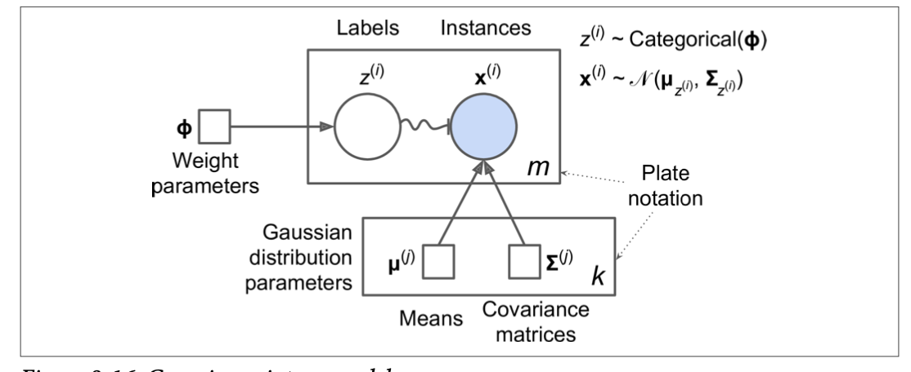
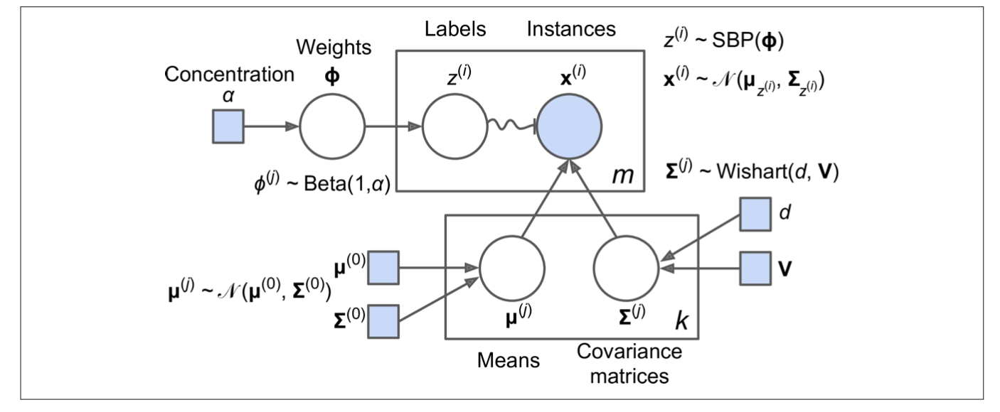

# Unsupervised Learning

**Usage**

* Dimensionality Reduction

* Clustering

  The goal is to group similar instances together into *clusters*. Can be used for data analysis, customer segmentation, recommender systems, search engines, image segmentation, semi-supervised learning, and dimensionality reduction. 

* Anomaly detection

  The goal is to learn what "normal" data looks like, and use this to detect abnormal instances, such as defective items on a production line or a new trend in a time series. 

* Density estimation

  The gial is to estimate the *probability density function* of the random process that generated the dataset. Commonly used for anomaly detection, also used for data analysis and visualization.

**Models**

* **K-Means**
  
  * Receipe
    ```python
    kmeans.labels_   # labels of the instances it was trained on
    kmeans.cluster_centers_ # centroids that kmeans found
    kmeans.transform(X) # measure the distance from each instance to every centroid. Can be used as non-linear dimensionality reduction technique
    ```
  * Algorithm
    
    **Convergence** It is guaranteed to converge in a finite number of steps (usually quite small). But it might not converge to the right solution.
    **Computational complexity** Linear with regards to *m*, *k* and *n*, where *m k n* refers to number of instances, number of clusters and number of dimensions (if data has a clustering structure).

  * Centroid initialization method

    **Custom init params** If another clustering algo is ran ealier and a reasonable controids have been obtained 
    ```python
    KMeans(n_clusters = 5, init=good_init, n_init = 1)
    ```
    **Multiple initialization** Run multiple times with different random initialization and keep the best
    ```python
    n_init = 10 (default value)
    kmeans.inertia_ # measures the mean squared distance between each instace and its closest centroid.
    kmeans.score(X) # returns negative inertia. Because a predictor's socre() method must always respect the "great is better" rule.
    ```

    **K-Means ++** Default used by KMeans class in sklearn. To initialize the centroid in such way that it is always away from the previous centroids.
    ```python
    init="random" # revert to original method, but rarely need to do so
    ```

    **Accelerated Kmeans and Mini-batch Kmeans**
    
    Accelerated kmeans is the default. 
    ```python
    algorithm = "full" # revert to original method, rarely need to do so
    ```

    Mini-batch kmeans, speed up typically by a factor of 3 or 4 and make it work for large dataset that does not fit in memory. 

  * Optimal number of clusters

    **Elbow method** Plot inertia vs k and find the elbow. Coarse method.

    **Silhouette score** An instance;s silhouette conefficient is equal to (b-a)/max(a,b) where a is the mean distance to the other instances in the same cluster, and b is the mean nearest-cluster distance. It varies between -1(bad) and 1 (good).
    ```python
    sklearn.metrics.silhouette_score(X, kmeans,labels_)
    ```
    Plot silhouette score vs k is one way to see which k should be chosen. Another even more informative way is to plot every instance's silhouette coefficient, sorted by the cluster thay are assigned to and by the value of the coefficient. This is a silhouette diagram. 

  * Limitation
    
    * Need to be run multiple times to avoid sub-optimal solution
    * Need to specify *k*.
    * Does not behave well when clusters have varying sizes, densities, or non-spherical shapes

  * Notes
    * Scale the input features before run k-means


  * Use cases
    
    * image segmentation
    ```python
    segmented_img = kmeans.cluster_centers_[kmeans.labels_]
    segmented_img = segmented_img.reshape(image.shape)
    ```

    * preprocessing
    ```python
    Pipeline([
        ("kmeans", KMeans(n_clusters = 50)), # n_cluster should be bigger than the real number of class
        ("log_reg", LogisticRegression()),
    ])

    # use in grid search
    param_grid = dict(kmeans__n_clusters=range(2,100))
    grif_clf = GridSearchCV(pipeline, param_grid, cv=3, verbose = 2)
    grid_clf.best_params_
    ```

    * Semi-supervised learning

    Use case where dataset consists of plenty of unlabeled instance and few labeled instances.
    ```python
    # label propagation
    # refers to the book at page 255 for detailed receipe
    ```

* **DBSCAN**

  * Algorithm 

    Defines clusters as continuous regions of high density. It works well if all the clsuters are dense enough, and they are well separated by low-density regions.
    ```python
    dbscan.labels_ # labels of all the instances 
    dbscan.core_sample_indices_ # index of core instances
    dbscan.components_ # core instances
    ```
    It does not have predict() method. It can't predict a new instance belonging. 
    ```python
    # this receipe will not detect anomaly as there is no anomaly in the training set, all are core instances
    knn.fit(dbscan.components_, dbscan.labels_[dbscan.core_sample_indices_])
    knn.predict(X_new)
    ```
    ```python
    # detect abnomalty 
    y_dist, y_pred_indx = knn.kneightbors(X_new, n_neighbors = 1)
    y_pred = dbscan.labels[dbscan.core_sample_indices_][y_pred_idx]
    y_pred[y_dist > 0.2] = -1
    y_pred.ravel()
    ```
    
  * Note

    * Capable of identifying any number of clusters, any shape, rebust to outliers 
    * Works poorly if density varies significantly across clsuters
    * Computational complexity is about O(mlogm).

* **Other clustering algo**

  * Agglomerative clustering

    It can capture clusters with various shapes, produces a flexible and informative cluster tree. But for it to scale well to large dataset, connectivity matrix are needed

  * Birth 

    Designed for large datasets, can be faster than batch k-means, as long as number of features is not too large (<20).

  * Mean-shift
   
    Has some features like DBSCAN, it can find any number of clusters of any shape, one parameter, and relies on lical density estimation. But it tens to chop clusters into pieces when they have internal density variation.  O(m**2), not suitable for large dataset.

  * Affinity propagation
    
    Can detect any number of clusters of diferrent size, but O(m**2), not suitable for large datasets.

  * Spectral clustering
    
    Takes in a similarity matrix and creates a low-dimensional embedding from it, and use another clustering algo in this low-dimensional space (sklearn use K-Means). Does not scale well, also does not behave well when the clusters have very different sizes. 

* **Gaussian Mixtures**

  Gaussian mixture models work great on clsuters with ellipsoidal shape. 

  * Usage 
  ```python
  # EM can end up converging to poor solutions, so it needs to be run several times. 
  gm = GaussianMixture(n_components=3, n_init=10) # default n_init is 1
  gm.weights_ 
  gm.means_
  gm.covariances_
  gm.converged_
  gm.n_iter_
  gm.sample(5)
  gm.score_samples(X) # estimate the density of the model at given location
  ```

  * Note
    
    When there are many dimensions,or many clusters yet few instances:
    ```python
    # limit the range of shapes and orientations the clusters can have 
    covariance_type = "spherical" # all clusters spherical (diff variances)
    covariance_type = "diag" # clusters take on any ellipsoidal shpae, but axes must be parallel to the coordiante axes (covariance matrices diagonal)
    covariance_type = "tied " # all clsuters have same ellipsoidal shape, size and orientation (same covariance matrix)
    covariance_type = "full" # default, no limitation
    ```
    spherical, and diag has O(kmn), while tired and full O(kmn**2+kn^^3)

    Gaussian mixture models try to fit all data, including the outliers, so if too many outliers, this will bias the model's view of "normality". The solution is to fit the model once, use it to detect and remove the most extreme outliers, then fit the model gain on cleaned up datset. Another approach is to use robust covariance stimation (EllipticEnvolope)

  * Use case
    ```python
    # detect anomaly
    densities = gm.score_samples(X)
    density_threshold = np.percentile(densities, 4)
    anomalies = X[density<density_threshold]
    ```

  * Number of clusters
    Use BIC or AIC to determine the optimal k

    BIC = log(m)p - 2 log(L)

    AIC = 2p - s log(L)

    m is number of instances, p is the number of parameters, and L is the maximized value of the likelihood function of the model.

    BIC and AIC often end up selecting the same model, but if they differ, the model selected by the BIC tends to be simpler, and it does not fit the data quite well, espeically for larger datasets.

  * Bayesian Guassian Mixture
    
    Compared to Gaussian Mixture model where user need to manuallys select k, BayesianGuassianMixture is capable of giving weights equal to or close to zero to unnecessary clsuters. In BGM, clsuter parameters are not treated as fixed model parameters, but as latent random variables. Prior knowledge about Z can be encoded in a probability distribution p(z) called prior. IT can be adjusted using the weight_concentration_prior. The bigger the dataset, the less the piors matter.


  * Guassian Mixture vs Bayesian Guassian Mixture

  
  

* **Other anomaly detection and novelty detection algos**
  
  * **Fast-MCD** Implement in EllipticEnvelop class. It assume normal instances are generated from a single Gaussian distribution, and it is contaminated with outliers that were not generated from this distribution. When it fit the data, it foten ignores the instances that are most likely outliers.

  * **Isolation forest** Efficient for outlier detection, especially in high-dimensional datasets. An anomaly is usually far from other instances, so on average (across lal the deicions tree) it tends to get isolated in less steps than normal instances.

  * **Local outlier factor** Compare the density of instances around a given instance to the density around its neighbors.

  * **One-class SVM** It works great. expecially for high-dimensional dataset, but does not sclae to large datasets.


  

  

